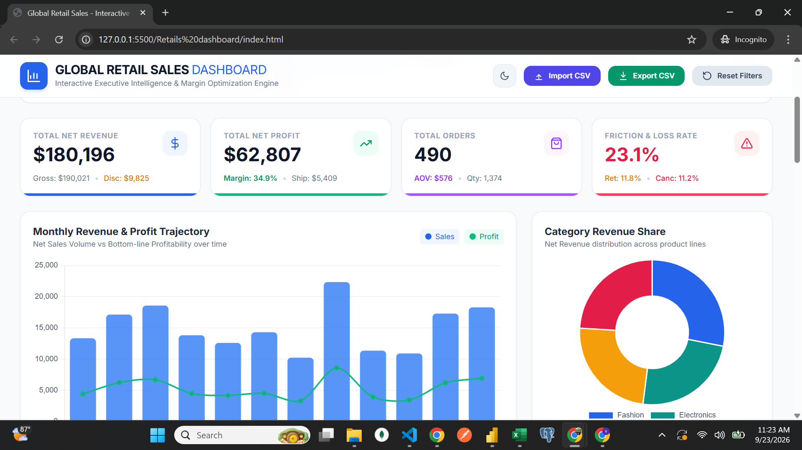

# 📊 Global Retail Sales — Interactive Analytics Dashboard

A single-file, interactive retail analytics dashboard built to practice **data visualization, statistical analysis, and data-cleaning workflows**. No backend, no database — everything runs client-side in the browser.

**🔗 Live demo:** [Live](https://retail-sales-dashboard-vaxp.vercel.app/)
## 📊 Dashboard Preview



> **Note on data:** This project uses a **synthetically generated dataset** (1,000 records) built specifically for practice. It is deliberately seeded with realistic messiness (duplicate rows, inconsistent labels, missing values) so the data-cleaning pipeline has something real to clean. It is not production data.

---

## Why I Built This

I wanted a project that went beyond "make a pretty chart" and actually forced me to think like an analyst: filter multi-dimensional data, question whether patterns in the data are *real* or just noise, and communicate findings — not just numbers.

The core question I set out to answer with the dashboard itself:
> *Does a higher discount actually correlate with a higher return rate — and if we capped discounts, how much profit would we recover?*

---

## Development Process

I built this with AI pair-programming (Claude), the way many developers and analysts work in 2026. My role was directing the requirements and architecture, debugging issues by describing symptoms and testing fixes, and deciding which statistical methods (Pearson correlation, 95% confidence intervals, Pareto analysis) actually fit the business questions I wanted to answer. Every feature below — including the bugs — was something I understood, tested, and could explain, not just accepted blindly.

---

## Features

### Core dashboard
- 6-dimension dynamic filtering (region, category, segment, channel, status, discount tier) + date range with quick presets
- 4 executive KPI cards (net revenue, net profit/margin, orders/AOV, friction & loss rate)
- 7 interactive charts (monthly trend, category share, regional profit, channel split, top products, discount-vs-return, Pareto)
- Sortable, searchable, paginated transaction table (1,000 rows)
- CSV export (filtered data) and CSV import (bring your own dataset)
- Dark/light theme, fully responsive, accessible (ARIA labels throughout)

### Analytical layer (the part I'm most proud of)
- **Auto-generated "Key Insights"** — plain-language narrative (e.g. *"Middle East has the highest margin but lowest order volume — expansion opportunity"*), regenerated live as filters change
- **Statistical Snapshot** — 95% confidence interval on Average Order Value, Pearson correlation coefficient (discount % vs. return rate) with strength/direction labeling, month-over-month growth, and outlier flagging
- **Data Quality Report** — a real cleaning pipeline (`cleanDataset()`) that deduplicates records, normalizes inconsistent region labels (e.g. "USA" → "North America"), and imputes missing values — then reports exactly how many rows were affected
- **What-if discount simulator** — a slider that recalculates projected profit if promotional discounts were capped, using live filtered data

---

## Tech Stack

| Layer | Choice | Why |
|---|---|---|
| Structure/Styling | HTML + Tailwind CSS (CDN) | Zero build step, fast iteration |
| Charts | Chart.js | Lightweight, responsive, handles combo charts (bar+line) cleanly |
| Icons | Hand-rolled inline SVG | See "Challenges" below — this replaced an external library |
| Data | Vanilla JS + `localStorage` | No backend needed; state persists per-browser |
| Statistics | Custom JS (mean, std dev, Pearson correlation) | Written from scratch to actually understand the math, not just call a library |

No frameworks, no build tools, no dependencies beyond two CDN scripts. The entire app is one `.html` file — open it and it runs.

---

## Challenges I Ran Into (and How I Solved Them)

This is the part most portfolios skip, but it's the most honest signal of actual problem-solving:

### 1. The dashboard rendered completely blank — silently
**Problem:** After adding dark-mode support, the whole dashboard would randomly show up empty — no charts, no KPIs, nothing. No visible error to the user.
**Root cause:** I was loading an external icon library from a CDN, and calling its `createIcons()` function as the *very first* line inside my `DOMContentLoaded` handler. When that script failed to load (CDN hiccup, blocked request, wrong URL — happened more than once), `createIcons()` threw a `ReferenceError`. Because JavaScript stops executing a function the moment it hits an uncaught error, **every line after it never ran** — including the code that loads data, builds charts, and renders the table.
**Fix:** Removed the external dependency entirely. I hand-wrote a small inline SVG icon set and a `renderIcons()` helper, wrapped in `try/catch` so that even if icon rendering fails, the rest of the app (data, charts, table) still runs. Lesson: **never let a non-critical UI dependency sit upstream of critical app logic** in an initialization sequence.

### 2. Data reset every time the page refreshed
**Problem:** The dataset was randomly regenerated on every page load, which made it impossible to demo consistently or trust a "before/after" comparison.
**Fix:** Cached the generated dataset in `localStorage` (wrapped in `try/catch` for private/incognito browsing where storage can throw), with an explicit "Regenerate" action for when a fresh sample is actually wanted.

### 3. CSV export broke on certain product/city names
**Problem:** Naively wrapping every field in quotes for CSV export corrupted rows where a field itself contained a comma or a double quote.
**Fix:** Wrote a proper CSV field-escaping function that only quotes fields containing commas/quotes/newlines, and doubles any internal quotes — the standard RFC 4180 approach.

### 4. Search felt laggy with a large table
**Problem:** Re-rendering the full filtered/paginated table on every single keystroke caused visible jank.
**Fix:** Added a 300ms debounce so the table only re-renders after the user pauses typing.

### 5. Making "correlation" and "confidence interval" mean something real, not decorative
**Problem:** It's easy to slap a fake-looking stat on a dashboard. I wanted the Pearson correlation and 95% CI to be *actually computed* from the filtered dataset, not hardcoded.
**Fix:** Implemented `mean()`, `stdDev()`, and `pearsonCorrelation()` from scratch, ran them against the live filtered array on every filter change, and added a companion bar chart (Return Rate by Discount Band) so the correlation number has a visual, sanity-checkable counterpart — if the chart and the stat disagree, something's wrong.

### 6. Simulating "messy" data on purpose
**Problem:** A perfectly clean generated dataset teaches nothing about real analyst work, where 60–70% of effort is data cleaning.
**Fix:** Deliberately injected ~1.5% duplicate rows, ~15% inconsistent region labels (aliases like "USA"/"EU"/"APAC"), and ~1.5% missing unit prices into the raw data — then built a `cleanDataset()` pipeline to fix them, with every correction counted and displayed in a "Data Quality Report" panel.

---

## What I'd Do With More Time

- Swap the generated dataset for a real public dataset (e.g. Kaggle Superstore) via the existing CSV import
- Rebuild the state layer in React for cleaner component boundaries
- Add unit tests (Jest) for the statistics functions — these are the one place a silent bug would be hardest to notice visually
- Companion SQL notebook doing the same analysis (window functions, cohort queries) against the same dataset, to show the same questions answered a different way

---

## Running It

No install needed — it's one HTML file.
```bash
# just open it
open index.html
# or serve it locally
python3 -m http.server
```

---

## Honest Limitations

- All data is synthetic — figures should not be read as real retail performance
- No authentication/multi-user support (by design — this is a single-user analysis tool)
- No automated tests yet (see "What I'd Do With More Time")
